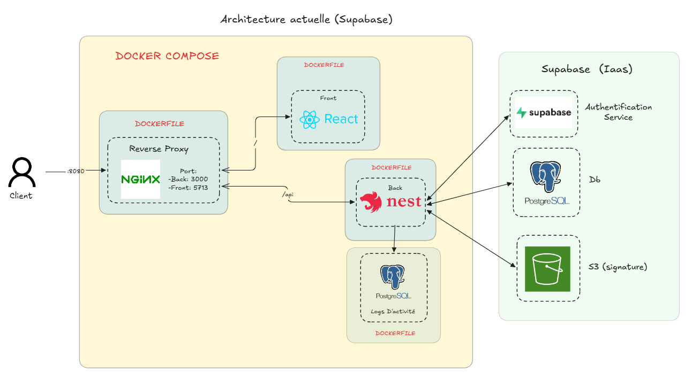

# Docker

## Architectures
Architecture 1 :


Mon parti pris d'être actuellement dépendant de Supabase a été fait pour accélérer le temps de développement, en utilisant ses services d'auth,le S3 pour les signatures ainsi que la DB.

Voici une autre architecture décentralisé de Supabase:
Architecture 2 :

### Installation de PNPM et dépendance

On crée un workspace pour installer pnpm pour optimiser l'espace disque puis copier les différences fichiers
```bash
WORKDIR /app

RUN corepack enable

COPY pnpm-lock.yaml pnpm-workspace.yaml package.json ./
COPY apps/frontend/package.json apps/frontend/

RUN pnpm install --frozen-lockfile

COPY apps/application apps/application      #ex: COPY apps/frontend apps/frontend
```